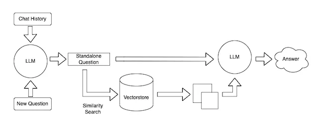
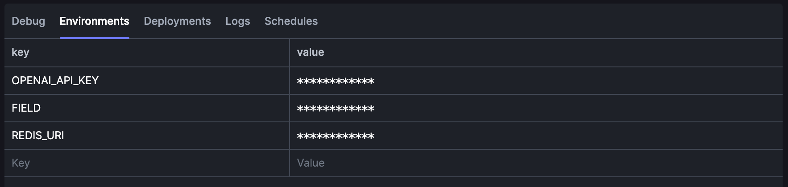
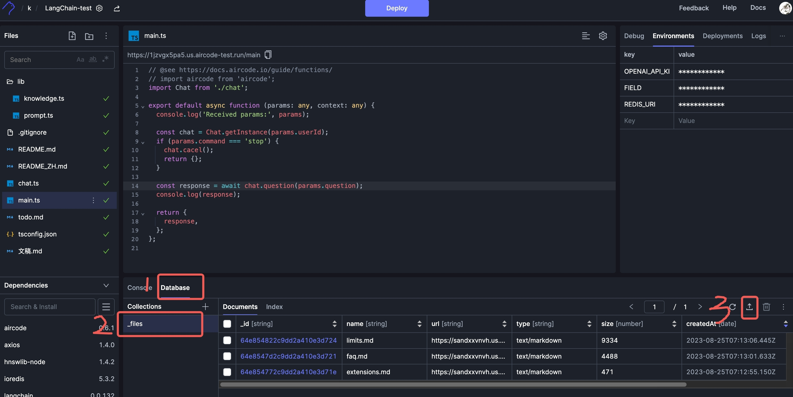
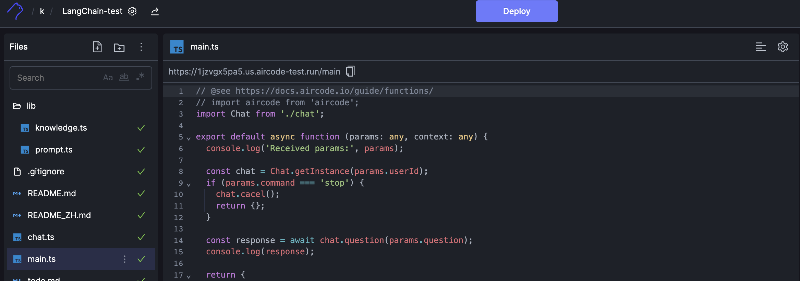

# README

## Introduce

This project helps you to use Langchain to build a knowledge base in your own field

## Usage

### 1. One-Click Deployment

To get a copy and launch your app on [AirCode](https://aircode.io/) by clicking the button below.

### 2. Setup environments

### 3. Upload the domain knowledge

Upload the domain knowledge through the upload file feature in the aircode database view. Tips: currently only supports text format

### 3. Implement your app

Modify code to implement your own app and click the `Deploy` button to publish your app online.

### 4. Advanced Options
- You can set the environment `TOKEN` to make you request more safety
- You can set the environment `REDIS_URI` to make you request quicker
